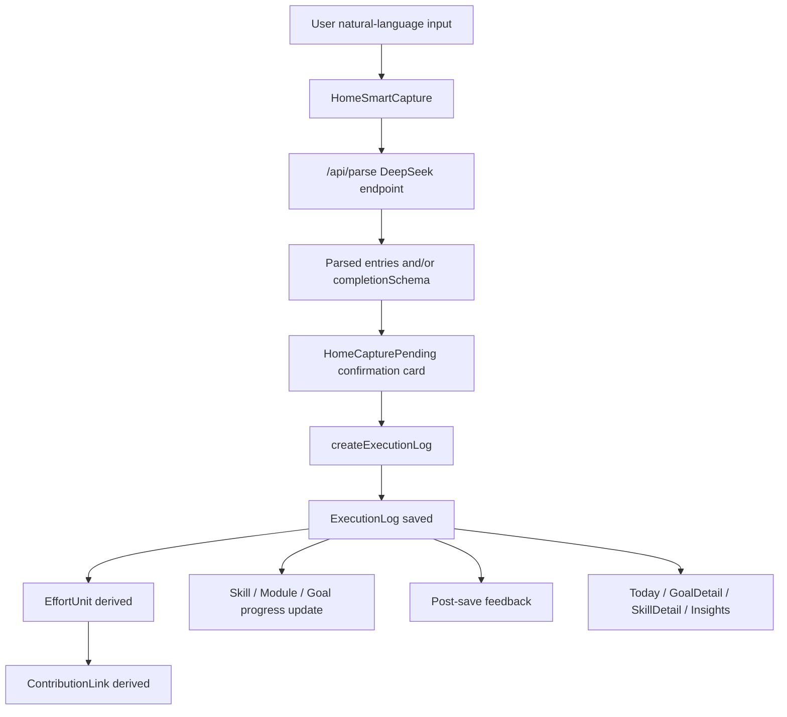
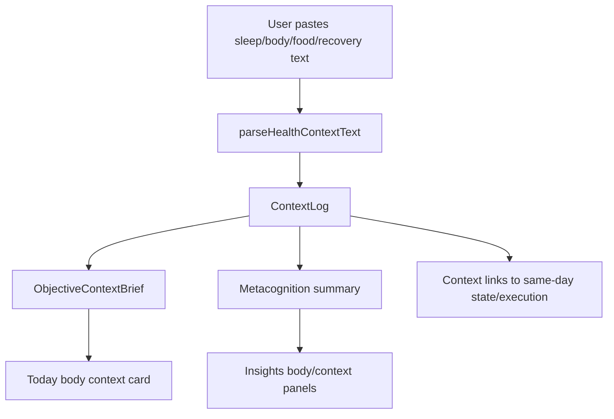
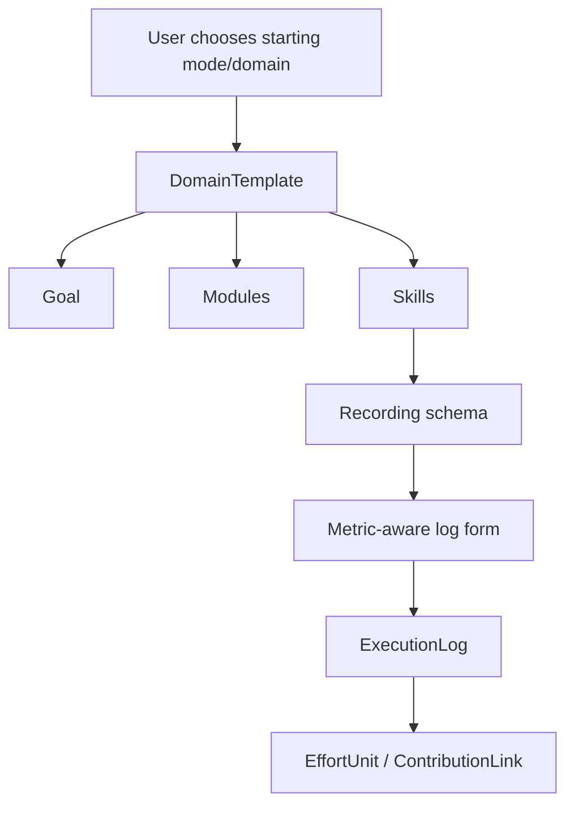

# QuestLife Phase Audit + Product Diagnosis v1

Audit date: 2026-06-12
Project: `/Users/kyrie/Documents/Codex Questlife/QuestLife`
Production URL: `https://questlife-alpha-orpin.vercel.app`

This report is based on `EXECUTION_RULES.md`, `PROJECT_STATUS.md`, `README.md`, and direct inspection of the current codebase. It is an audit only: no application source files were changed.

## 1. Current Product Stage

QuestLife is an advanced alpha / founder-use prototype with a real behavioral data pipeline already in place. It is no longer just a goal tracker demo: the product now has natural-language capture, guided completion, domain templates, execution logs, effort units, contribution links, post-save feedback, state check-ins, body-context logs, and an Insights surface.

It is not yet a stable daily-driver product for a general user. The main reason is not lack of features. The main reason is fragmentation: several strong subsystems exist, but the first-screen judgment loop, parser reliability, context interpretation, and Insights information architecture are not yet unified into one simple daily operating experience.

Current maturity by layer:

| Layer | Status | Diagnosis |
| --- | --- | --- |
| Goal / Module / Skill data model | Production-usable | Core hierarchy exists and is used across store, templates, Today, GoalDetail, SkillDetail. |
| Natural language execution capture | Working but weak | B-3/B-4 core paths are validated, but parsing and completion routing still depend on brittle rules plus LLM output shape. |
| ExecutionLog save chain | Production-usable | `createExecutionLog` now derives EffortUnits and ContributionLinks, updates progress, and handles deletion cleanup. |
| Quantified Effort / Contribution model | Working but early | Data layer exists and is useful, but UI/product explanation is still shallow. |
| Post-save feedback | Production-validated v1 | B4 passed manual production verification for strength, learning, custom actions, and no-log cases. |
| State / meta-cognition loop | Working but weak | State check-ins, after-state capture, and pattern panels exist, but the product story is noisy. |
| Objective context layer | Working but brittle | Context logs and body brief exist, but manual text parsing is narrow and not yet central to Today. |
| Insights | Feature-rich but cluttered | Many panels exist; the hierarchy is not yet clear enough for a user to know what matters today. |
| Onboarding/templates | Implemented v1 | New-user setup and domain structures exist; needs real-use simplification and parser hardening. |
| Mobile/web UI | Improved but uneven | Mobile is closer; web/RN-Web has known rendering pitfalls and requires production UI validation. |

## 2. What Is Actually Working

### Core Data + Store

The main data source is local persistent app data loaded from `src/storage.ts` with key `questlife.v1`. The app stores goals, categories, modules, module-skill links, skills, actions, execution logs, raw captures, effort units, contribution links, rescue logs, state check-ins, context logs, schedule blocks, and settings.

The store in `src/store.tsx` is the central write path. The most important production chain is:

1. User creates or completes a capture/log.
2. `createExecutionLog` sanitizes and saves the `ExecutionLog`.
3. Effort units are derived through `createEffortUnitsFromExecutionLog`.
4. Contribution links are derived through `generateContributionLinks`.
5. Skill progress is recomputed or updated.
6. Linked schedule blocks can be marked complete.
7. Deletion removes related derived data.

This is the right foundation. ExecutionLog remains the source record; EffortUnit and ContributionLink are derived layers.

### Natural Language Capture

`api/parse.ts` is the DeepSeek parse endpoint. It now asks for both `entries` and a top-level `completionSchema`. The frontend flow in `HomeSmartCapture.tsx` and `HomeCapturePending.tsx` supports:

- Parsed entries with direct confirmation.
- Top-level completion schema with empty entries.
- Completion cards for ambiguous actions.
- Suggested action chips.
- Custom action chips.
- Domain-aware routing.
- B4 post-save feedback.

Recent production validation confirms:

- `卧推 80kg 3x5` saves and gives baseline feedback.
- `卧推 82.5kg 3x5` compares to previous bench.
- `SQL 20分钟` routes to learning/time rather than fitness.
- `打篮球 + 三分投篮` preserves custom action.
- Food-like input such as `吃了点巧克力` does not create false execution progress.

### Domain Templates

`src/domainTemplates.ts` defines template-driven goal structures. Goal creation can apply templates to generate modules, skills, recording fields, progress types, metric types, and schedule hints. This is a major product advantage because it lets QuestLife avoid asking new users to manually design the entire goal system.

The template engine is currently useful as a setup accelerator. It is not yet a personalized setup engine; no LLM generation, textbook import, or adaptive planning exists.

### Post-Save Progress Feedback

`src/utils/progressFeedback.ts` now provides a meaningful v1 feedback layer:

- Strength baseline and comparison.
- Time-based learning feedback.
- Custom action feedback.
- No false progress feedback for non-execution input.

This is one of the strongest current product moments because it closes the loop immediately after the user logs something.

### Data Deletion / Residue Fixes

Recent Data Residue Diagnosis verified that SQL residue was live data, not UI ghost data. Deleting associated captures can now remove execution logs, effort units, and contribution links. Live selectors in Insights filter deleted/orphan data more reliably.

This is important because QuestLife has many derived data layers. Without this cleanup, the user loses trust quickly.

## 3. What Is Only Partially Working

### Objective Context Layer

The Objective Context Layer exists:

- `ContextLog` is part of `AppData`.
- `HomeScreen` has a body/sleep context card.
- `parseHealthContextText` turns pasted text into context logs.
- `buildObjectiveContextBrief` summarizes recent objective state.
- Insights includes a body context panel and context links.

However, this layer is still brittle and under-productized.

Observed parser issue:

The current parser recognizes patterns like:

- `Sleep 6h 12m`
- `Deep sleep 48m`
- `Resting HR 64`
- `HRV 38`
- `睡眠6小时12分钟`
- `睡了6小时12分钟`

But natural Chinese phrasing such as `我昨天晚上12点睡觉睡了8个小时` is likely not parsed reliably because the regex expects a narrow phrase around the number. This creates a serious gap: users speak naturally, but the context layer expects data-export-like text.

Product implication:

The system can technically store and interpret body context, but the user does not yet experience it as a trustworthy daily companion. It may still feel like “I pasted something and nothing meaningful happened.”

### Today Command Center

Today has strong pieces:

- Smart capture at the top.
- Body context card.
- Now command logic.
- Rescue strip.
- Today plan.
- State check-in.
- Logs and feedback.

But the Today page is not yet one coherent judgment surface.

`buildTodayCommand` currently prioritizes pending capture, low-state rescue, recent feedback review, schedule blocks, active sessions, unlogged skills, and empty state. It does not deeply integrate objective context logs yet. The Body Context card is adjacent to execution, but not fully fused into the action recommendation.

The next product leap is not another panel. It is one daily operating brief:

> Given your sleep/body state, recent execution, state check-ins, and goal system, what should you do next and how hard should you push?

### Insights

Insights contains many engines and panels:

- Meta-cognition summary.
- State trends.
- State patterns.
- Body context.
- Behavior links.
- Command strip.
- Ability Map.
- Signal Grid.
- Weekly state chart.
- Rescue stats.
- Time allocation.
- Task allocation.
- Metric allocation.
- Heatmap.
- System loop overview.
- Prediction accuracy.
- Recovery insights.
- Monthly comparison.
- Growth curve.
- Anomaly detection.

This is too much for the current stage. Many sections are individually reasonable, but together they create a “data museum” effect. Users need one or two clear judgments first, then evidence, then deep archive.

### PROJECT_STATUS Drift

`PROJECT_STATUS.md` contains useful history, but it currently has at least one status inconsistency:

- The `Meta-cognition Loop v1.2 - State Pattern Interpretation` section says production validation accepted commits `8aac559` and `e1d6220`.
- Those commits appear to belong to the Objective Context Layer work.
- A later `Objective Context Layer v1 - Sleep / Recovery / Food Bridge` section still states production verification pending.

This creates ambiguity about what is actually validated. The status file needs a cleanup pass before it is used as a strict roadmap source.

## 4. Current System Map

### Capture + Execution Flow

### Context + Meta-Cognition Flow

### Domain Template Flow

## 5. Feature-by-Feature Status

| Feature / Spec | Current status | Notes |
| --- | --- | --- |
| Goal / Module / Skill hierarchy | Working | Core hierarchy is usable and connected. |
| Domain Template Engine v1 | Working but early | Good setup base; still rule-based and not personalized. |
| Onboarding v1 | Implemented | Helps first-time users; needs real-use simplification. |
| Today Command Center | Working but weak | Has components; not yet unified into one judgment surface. |
| Brain-Off Rescue | Working | Low-friction rescue flow exists; keep lightweight. |
| State Check-ins | Working | Multiple check-ins supported; useful input for patterns. |
| Smart Capture B-3.x | Working but brittle | Major production flows validated; parser/completion remains fragile. |
| Custom action completion | Production-fixed | Custom chips save into the execution chain. |
| B4 Post-save Feedback | Production validated | Strongest current feedback loop. |
| Quantified Effort Model v1 | Working data layer | Needs clearer UI/product explanation. |
| ContributionLink v1 | Working data layer | Useful but still opaque to user. |
| Data Residue / Deletion Chain | Production validated for SQL case | Important trust fix; keep testing with more domains. |
| Objective Context Layer v1 | Working but brittle | Parser and brief need the next polish pass. |
| Meta-cognition Loop | Working but cluttered | Valuable, but too much UI and not enough prioritization. |
| Insights | Overbuilt for current UX | Needs IA pruning, not more cards. |
| Theme / mobile UI | Improved but uneven | Mobile is more usable; web/RN-Web remains a known risk. |
| Analytics tracking | Present | Must remain anonymous and not upload user text. |

## 6. Product Diagnosis

### The Core Product Is Becoming Real

QuestLife is strongest when it does this:

1. User says what happened in natural language.
2. The system asks only for missing information.
3. The user confirms.
4. The system records structured effort.
5. The system immediately explains what changed or what was learned.

That is the product’s “aha” loop.

The current B4 flow shows this clearly. When a user logs `卧推 82.5kg 3x5` and sees a comparison against prior bench work, QuestLife feels different from a habit tracker.

### The Main Bottleneck Is Not More Features

The next bottleneck is reliability and judgment quality:

- Can the system understand everyday language without silently failing?
- Can it tell the user what matters today in one sentence?
- Can it avoid showing five different partially-confident insight panels?
- Can it make context like sleep actually affect execution guidance?

Until those are stable, adding more models or panels will increase complexity faster than value.

### The App Needs One Primary Daily Loop

Current loop candidates:

- Smart capture.
- Today command.
- Body context.
- State check-in.
- Post-save feedback.
- Insights.

These should not compete. The daily loop should be:

Insights should support this loop, not replace it.

## 7. Data Model Diagnosis

### Strong Decisions

- Keeping `ExecutionLog` as source-of-truth and deriving `EffortUnit` / `ContributionLink` is correct.
- Keeping `ContextLog` separate from execution logs is correct.
- Storing `RawCapture` is useful for traceability and deletion.
- Filtering orphan/deleted data through live selectors is essential.

### Risks

- Several derived layers now exist: execution logs, effort units, contribution links, raw captures, context logs, instant feedback, meta-cognition summaries, insights.
- If any deletion/update path misses one layer, trust breaks.
- Some logic is still duplicated between capture completion, routing, record forms, and fallback smart routing.
- The status document has drifted from real validation state, which can lead future work in the wrong direction.

### Recommendation

Before major new data systems, add more automated integrity checks around:

- RawCapture -> ExecutionLog links.
- ExecutionLog -> EffortUnit links.
- EffortUnit -> ContributionLink links.
- Deleted skill / goal / module handling.
- ContextLog date alignment.

## 8. Insights Diagnosis

Insights currently demonstrates technical ambition more than user clarity.

The useful insight stack should be:

1. **Main Judgment**
   - What is the one thing I should understand today?
   - Example: “Your execution quality is lower on short sleep. Today should be a lighter but still active day.”

2. **Evidence**
   - 2-3 supporting cards.
   - Example: sleep, state, last execution, recent effort.

3. **Deep Archive**
   - Ability map, signal grid, monthly comparison, compound curve, prediction accuracy.

Current Insights shows too much of layer 3 too early.

Recommended pruning:

- Keep top: one meta summary card.
- Keep body context near state only if it changes the recommendation.
- Move experimental cards into an “Advanced signals” section.
- Hide low-confidence / insufficient-data cards more aggressively.
- Reduce the number of simultaneous “pattern” sections.

## 9. Objective Context + Apple Health Roadmap

### Current State

QuestLife currently accepts objective context through manual text parsing. This is the correct pre-HealthKit foundation because `ContextLog` is source-agnostic. The same data model can later receive:

- Manual pasted text.
- CSV export.
- Apple HealthKit.
- Wearable imports.
- Future cloud integrations.

### Current Weakness

The parser is too narrow for natural language. It understands data-export-like snippets better than real user phrasing.

Example issue:

`我昨天晚上12点睡觉睡了8个小时`

This should create a sleep context log, but the current regex likely misses it.

### Should Apple Health Come Next?

Not immediately.

Apple Health integration should come after:

1. Context parser v1.1 is stable enough for manual text.
2. Daily Operating Brief actually uses context to change recommendations.
3. The user can see why sleep/recovery mattered.

Otherwise HealthKit would import more data into an unclear interpretation layer.

### Suggested Apple Health Path

Phase A: Manual Context v1.1

- Better Chinese and English sleep phrases.
- Workout/fatigue/food recovery phrase parsing.
- Clear parse preview.
- Better “what changed today” brief.

Phase B: Health Export Import

- Support pasted/exported Apple Health summaries or CSV-like text.
- Keep data as `ContextLog`.

Phase C: Native iOS / HealthKit

- Add iOS HealthKit permission flow.
- Import sleep, HRV, resting heart rate, steps, workouts.
- Map to existing `ContextLog`.

The current architecture can support this, but the interpretation layer should be improved first.

## 10. UX Diagnosis

### What Feels Good

- Natural language capture is the right primary input.
- Confirmation cards are better than raw forms.
- Post-save feedback is valuable.
- Domain templates reduce setup friction.
- Rescue mode has a clear emotional purpose.

### What Feels Heavy

- Too many cards on Today and Insights.
- Too many partially overlapping concepts: state, context, meta-cognition, insights, command, feedback.
- Record flow still has too many branches in code, even if the UI is improving.
- Some features are technically present but not explained in user terms.

### UX Principle for the Next Phase

Every page should answer one question:

- Today: “What should I do now?”
- GoalDetail: “Is this goal moving?”
- SkillDetail: “Am I improving at this skill?”
- Insights: “What pattern should I understand?”
- Settings/Debug: “Is my data healthy?”

If a section does not answer the page’s main question, hide it or move it deeper.

## 11. Technical Risks

| Risk | Severity | Evidence |
| --- | --- | --- |
| Parser brittleness | High | Completion schema and context parser both rely on exact output/regex shapes. |
| Store complexity | High | `store.tsx` is the hub for creation, deletion, derivation, repair, template application, reminders. |
| UI/data coupling | Medium | `HomeCapturePending.tsx` contains heavy save/routing logic in a screen component. |
| Derived data drift | Medium | Recent SQL residue work shows how easy stale derived data can appear. |
| PROJECT_STATUS drift | Medium | Validation notes are partly inconsistent. |
| Web/RN-Web divergence | Medium | Execution rules explicitly warn about web-specific API differences. |
| Insights overload | Medium | Many panels and engines exist before product prioritization is stable. |

## 12. Recommended Next 3 Priorities

### Priority 1: Context Parser v1.1 + Daily Context Trust

Goal:
Make manual objective context feel reliable before any Apple Health work.

Scope:

- Parse natural Chinese sleep phrases such as:
  - `我昨晚睡了8小时`
  - `昨天12点睡觉睡了8个小时`
  - `从12点睡到8点`
  - `深睡40分钟`
- Parse simple recovery/workout/food context phrases.
- Show a clear parse preview before saving.
- Improve the brief for single-data cases so users do not feel ignored.

Why this first:

The user already noticed that sleep context did not behave as expected. If context cannot be trusted manually, importing Apple Health data will not solve the product problem.

### Priority 2: Daily Operating Brief v1

Goal:
Unify Today’s context, state, recent execution, and next action into one clear first-screen judgment.

Scope:

- One compact “Today brief” at the top.
- Uses:
  - latest state check-in
  - recent context logs
  - recent execution feedback
  - pending capture
  - schedule / unlogged skills
- Produces:
  - recommended intensity
  - one next action
  - why this action

Why this second:

QuestLife needs to feel like an operating system, not a collection of panels.

### Priority 3: Insights IA Cleanup

Goal:
Reduce Insights clutter and promote only the most actionable pattern.

Scope:

- Top-level summary: one main judgment.
- Evidence cards: 2-3 supporting signals.
- Advanced section: ability map, signal grid, monthly comparison, compound curve, prediction accuracy.
- Hide weak/insufficient signals by default.

Why this third:

The insight engine already has many signals. The product problem is prioritization, not signal count.

## 13. What Not To Do Next

Do not start with:

- Apple HealthKit native integration.
- More domain templates.
- More insight cards.
- More forecast/probability features.
- A full UI redesign.
- A new data model.
- More completion keywords as the main fix.

These will increase complexity before the core loop is trustworthy.

## 14. Product Strategy

QuestLife’s strategic wedge is not “habit tracking.” It is:

> A personal operating system that turns messy daily behavior into structured effort, objective context, and actionable self-knowledge.

The most differentiated loop is:

1. Capture what happened naturally.
2. Convert it into structured effort.
3. Connect it to goals and skills.
4. Compare it with prior behavior.
5. Add state/body context.
6. Suggest the next right-sized action.

### Likely First User Segment

The best early users are self-improvement power users who already care about:

- Training progress.
- Learning progress.
- Sleep/recovery.
- Exam/project execution.
- Personal analytics.

This is not yet a mass-market casual habit app.

### Fitness Use Case

The fitness case can be strong because:

- Strength training has concrete comparable metrics.
- Users care about progressive overload.
- Recovery/sleep context matters.
- Post-save feedback is obvious.

Required polish:

- Natural workout capture must be reliable.
- Session-level logging should stay lightweight.
- Recovery context should influence the next action.

### Learning / Coding Use Case

This is also strong because:

- Time and topic are easy to record.
- “What did I study and did it move my goal?” is valuable.
- SQL/Python routing has already been validated as important.

Required polish:

- Avoid routing learning into fitness.
- Improve topic/scope capture.
- Show learning streak and comparable progress without noisy charts.

### Professional / Psychology / Coaching Use Case

There is future potential, but it is not ready for clinical or professional claims. The product can support reflective behavior analysis, but should avoid diagnostic language.

Useful framing:

- “Patterns between state, recovery, and execution.”
- “Self-observation and planning support.”

Avoid:

- Medical claims.
- Mental health diagnosis.
- Overconfident causal statements.

## 15. Release Readiness

Current readiness:

| Audience | Readiness | Notes |
| --- | --- | --- |
| Founder / internal daily use | Yes | Good enough for continued self-testing. |
| Friendly beta users | Almost | Needs parser/context trust and fewer confusing panels. |
| Public launch | No | Too many rough edges and hidden complexity. |
| Paid consumer product | No | Needs stable onboarding, clearer value, and data trust. |
| Professional/coach use | No | Needs export, privacy, careful language, and stronger validation. |

## 16. Documentation / Process Notes

The execution rules are appropriate and should remain strict:

- No broad rewrites.
- Use existing store and design system.
- No data migrations unless explicit.
- Real production web UI validation for functional work.
- Git push deployment through GitHub/Vercel.

Recommended documentation cleanup:

- Fix `PROJECT_STATUS.md` validation status drift.
- Add a concise “Current active roadmap” section near the top.
- Mark older completed sections as archive.
- Keep only one “next priority” list.

## 17. Final Diagnosis

QuestLife has crossed the hardest early threshold: it has a real execution-to-feedback data loop. The product can already capture an action, structure it, save it, derive effort, link it to goals, and tell the user whether they improved.

The next phase should not be bigger. It should be sharper.

The most important product question now is:

> Can QuestLife reliably tell me what today means and what I should do next?

To answer that, the next work should focus on parser trust, daily context interpretation, and Insights simplification.

Recommended next task:

**Context Parser v1.1 + Daily Context Trust**

This is the highest-leverage bridge between the current data system and the future Apple Health / personal operating system vision.
