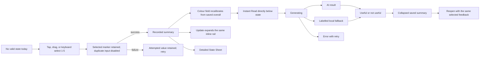

# V11 Stage 2 State Calibration QA

## Scope

- Route: `questlife_v11_ui=stage2-rebaseline`
- Branch: `design/questlife-product-v2`
- This pass changes only the isolated Stage 2 rebaseline fixture, its shared Sheet shell, and presentation-only i18n.
- `HomeScreen`, Store, APIs, schemas, production handlers, and persistence were not modified.
- No push or deployment was performed. Stage 3 was not started.

## Interaction state diagram

## Existing handler mapping

| UI action | Existing production handler path | Existing Store / persistence path | This pass |
| --- | --- | --- | --- |
| Quick overall state | `TodayStateStrip.onSelect` -> `saveStateCheckIn` | `createStateCheckIn` -> Store `mutate`; then `generateInstantDecisionBrief` | Handler path inspected previously. Isolated rail calls the existing mapped callback contract. Real Store write remains UNVERIFIED because `HomeScreen` changes were prohibited. |
| Open detailed state | `openV11State` -> `openStateModal` | Reads latest `StateCheckIn` and current form state | Existing entry preserved. Only the isolated Sheet presentation changed. |
| Save detailed state | `saveV11StateAssessment` -> `saveStateAssessment` | Existing daily-state write, `persistCurrentState`, then `saveStateCheckIn` | Existing seven numeric dimensions and categorical fields preserved. Real persistence remains UNVERIFIED in this isolated route. |
| Generate Instant Read | `saveStateCheckIn` -> `generateInstantDecisionBrief` | `addDecisionResult` updates the existing DecisionResult collection | Generating, ready, labelled fallback, and error/retry states passed locally. Live API output remains UNVERIFIED. |
| Save feedback | `markInstantDecisionFeedback` | `updateDecisionResultFeedback(resultId, 'useful' | 'not_useful')` updates the same DecisionResult | Both distinct local values, selected states, collapse, reopen, and value switching passed. Real refresh persistence remains UNVERIFIED. |

## Shared calibration rail

- File: `src/v11-stage2-rebaseline/V11CalibrationRail.tsx`
- Values are restricted to the discrete set `1, 2, 3, 4, 5`.
- Supports tap, pointer drag with nearest-stop snapping, `ArrowLeft`, `ArrowRight`, `ArrowUp`, `ArrowDown`, `Home`, and `End`.
- Each stop exposes its full metric, numeric value, and semantic meaning to assistive technology.
- S0 accepts `selectedValue=null`; it does not preselect `3`.
- The marker uses local preview state so saving and error states retain the attempted value.
- Quick Today and Sheet variants share semantics and interaction while allowing different spacing.
- Measured touch regions: Today approximately `63.8 x 52px` at 375px; detailed Sheet minimum approximately `62.2 x 48px` at 375px.

## Semantic presentation tokens

- Uncalibrated: no state-field overlay.
- Saved `1-2`: existing `predicted` semantic hue, used as restrained cool indigo.
- Saved `3`: existing `textSubtle` semantic hue, used as neutral blue-grey.
- Saved `4-5`: existing `neutral` semantic hue, used as restrained cyan.
- Selected rail marker: existing V11 primary glow token.
- No red/green good/bad encoding was added.
- Normal transition uses the approved `640ms` deliberate token; reduced motion uses `0.001ms`.
- The shared Sheet portal receives theme tokens directly because React Native Web `Modal` renders outside the Today root CSS-variable scope.
- Light Sheet glass uses the existing elevated-surface token at higher opacity over the existing overlay token. Dark controls contain no computed pure-white backgrounds.

## Local validation

| Case | Result |
| --- | --- |
| 375x667 S0 | Passed: no selected value, five complete accessible meanings, no horizontal overflow. |
| Tap selection | Passed: one save sequence, recorded summary, and Instant Read generation. |
| Drag-to-snap | Passed: a real browser drag from stop 5 to stop 1 saved value `1`. |
| Keyboard | Passed: `ArrowRight` moved value `4` to `5`; Home/End and both axis arrow mappings are implemented by the same bounded handler. |
| Save failure | Passed: attempted value `2` remained selected, root remained uncalibrated, concise retry stayed visible. |
| Recorded summary / Update | Passed: saved `4 / 5` collapsed; Update reopened the same rail with stop 4 selected. |
| Colour field | Passed: no overlay in S0; `1` settled to low field; `4-5` settled to high field only after save. |
| Instant Read | Passed: generating, AI result, labelled fallback, and error with retry. |
| Feedback | Passed locally: `useful` and `not_useful` have distinct selected states; switching replaces the local value; collapsed summary and reopening preserve the selected value. |
| Detailed fields | Passed: seven existing numeric dimensions use 35 rail stops; existing health, context, and notes remain. |
| 375x667 Sheet | Passed: frame `351px` wide with `12px` side insets; footer bottom at `659px`; no horizontal overflow. |
| 393x852 Sheet | Passed: frame `369px` wide with `12px` side insets; complete 26px radius; body scrolls above fixed footer. |
| 1280x900 Sheet | Passed: centred `620px` frame; one accessible close control; no horizontal overflow. |
| Sheet scroll ownership | Passed: glass clip remains at `scrollTop=0`; only the production Sheet body scrolls. |
| Keyboard-sized viewport simulation | Passed at `393x520`: focused notes moved above footer; header stayed at top; footer stayed at viewport bottom. Physical software keyboard remains UNVERIFIED. |
| Dark theme | Passed: zero computed pure-white button/input/textarea backgrounds in the detailed Sheet. |
| Light theme | Passed locally: text and rail meanings remain readable after the 320ms Sheet entry settles. |
| Reduced motion | Passed: rail and colour-field transitions report `0.001ms`; saved field changes without visible transition. |

## Performance

Measured with the complete corrected state composition in the Codex in-app browser on macOS, using 393x852 responsive viewport and 300 animation-frame samples per run.

| Flow | P50 | P95 | Max | Frames above 20ms |
| --- | ---: | ---: | ---: | ---: |
| Dark: S0 rail -> save -> Instant Read -> detailed Sheet -> Sheet scroll | 16.7ms | 17.2ms | 17.6ms | 0 / 300 |
| Light: detailed Sheet open and scroll | 16.7ms | 17.4ms | 17.7ms | 0 / 300 |
| Dark reduced motion: detailed Sheet open and scroll | 16.7ms | 17.4ms | 17.7ms | 0 / 300 |

This measurement does not replace physical iPhone Safari performance verification.

## Screenshot evidence

- S0 rail: `/private/tmp/questlife-calibration-s0-375.png`
- Recorded summary: `/private/tmp/questlife-calibration-recorded-375.png`
- Inline Update: `/private/tmp/questlife-calibration-update-375.png`
- Save error: `/private/tmp/questlife-calibration-save-error-375.png`
- Instant generating: `/private/tmp/questlife-calibration-instant-generating-375.png`
- Instant AI result: `/private/tmp/questlife-calibration-instant-ai-result-375.png`
- Instant fallback: `/private/tmp/questlife-calibration-instant-fallback-visible-375.png`
- Useful selected: `/private/tmp/questlife-calibration-feedback-useful-375.png`
- Not useful selected: `/private/tmp/questlife-calibration-feedback-not-useful-375.png`
- Detailed Sheet dark: `/private/tmp/questlife-calibration-sheet-dark-393.png`
- Detailed Sheet light: `/private/tmp/questlife-calibration-sheet-light-en-393.png`
- Keyboard-sized viewport simulation: `/private/tmp/questlife-calibration-sheet-keyboard-simulated-393.png`
- Detailed Sheet desktop: `/private/tmp/questlife-calibration-sheet-dark-1280.png`
- Dark legacy white-control before: `/private/tmp/questlife-state-detail-before-dark-393.png`
- Dark semantic-control after: `/private/tmp/questlife-calibration-sheet-dark-393.png`

## UNVERIFIED

- Physical iPhone Safari visuals, browser-bar expansion/collapse, real safe-area values, touch drag, software keyboard, and performance.
- Real Store state write and refresh persistence, because this correction remains isolated and `HomeScreen` modification was prohibited.
- Live Instant Read API response, retry network behaviour, and real DecisionResult refresh persistence.
- Screen-reader behaviour on VoiceOver hardware; DOM labels and control semantics were verified locally.

## Approval boundary

- Physical iPhone Safari and visual/product approval are still required.
- No push or deployment was performed.
- Stage 3 was not started.
