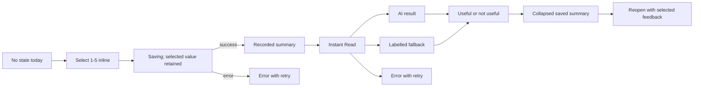

# V11 Stage 2 State Entry Correction QA

## Scope

- Route: `questlife_v11_ui=stage2-rebaseline`
- Branch: `design/questlife-product-v2`
- This pass changes only the isolated Stage 2 rebaseline fixture and its State Sheet presentation.
- `HomeScreen`, Store, APIs, schemas, handlers, and persistence were not modified.
- Production Store and refresh persistence remain unverified until the approved integration pass.

## State flow

## Existing handler mapping

| UI action | Existing production handler path | Existing Store / persistence path | Verification |
| --- | --- | --- | --- |
| Quick overall state | `TodayStateStrip.onSelect` -> `saveStateCheckIn` | `createStateCheckIn` -> Store `mutate`; then `generateInstantDecisionBrief` | Existing path inspected. Rebaseline fixture interaction passed. Real Store write and refresh are UNVERIFIED because `HomeScreen` changes were prohibited. |
| Open detailed state | `openV11State` -> `openStateModal` | Reads latest `StateCheckIn` and current state into existing form state | Existing path inspected. Rebaseline Sheet open passed. |
| Save detailed state | `saveV11StateAssessment` -> `saveStateAssessment` | Existing daily-state AsyncStorage write, `persistCurrentState`, then `saveStateCheckIn` | Existing path inspected. Rebaseline visual save passed. Real Store write is UNVERIFIED in this isolated route. |
| Generate Instant Read | `saveStateCheckIn` -> `generateInstantDecisionBrief` | `addDecisionResult` replaces same ID before compacting DecisionResults | Existing path inspected. Fixture generating, result, fallback, and error states passed. Live API result is UNVERIFIED. |
| Save Instant Read feedback | `markInstantDecisionFeedback` | `updateDecisionResultFeedback(resultId, 'useful' | 'not_useful')` updates the existing DecisionResult | Existing path inspected. Both distinct fixture selected states passed. Refresh persistence is UNVERIFIED in this isolated route. |

## Local verification

| Case | Result |
| --- | --- |
| 375x667 S0 quick state entry | Passed: five visible labelled choices, 52px minimum height, no horizontal overflow. |
| Saving and recorded summary | Passed: selection retained, summary collapses after save, Update expands inline. |
| Save failure | Passed: selected value remains visible and retry remains available. |
| Instant Read | Passed: generating, ready, labelled fallback, error/retry, collapse/reopen. |
| Feedback semantics | Passed locally: `useful` and `not_useful` remain distinct and changing selection replaces the local value. |
| 393x852 dark State Sheet | Passed: seven existing rating dimensions, context, notes, internal scroll, sticky footer. |
| 393x852 light State Sheet | Passed: selected and unselected controls remain readable. |
| 1280x900 State Sheet | Passed: 620px centred sheet, no horizontal overflow. |
| Touch targets | Passed: rating choices 48px; context tags 44px. |
| Dark white-surface audit | Passed: zero pure-white State Sheet controls found by computed-style audit. |
| Reduced motion | Passed: root reports reduced mode and no fixture animations remain active. |
| Keyboard focus | Passed in desktop mobile viewport simulation: notes retain focus and footer moves above the simulated visual viewport. Physical iPhone keyboard is UNVERIFIED. |
| iOS safe area | CSS uses `env(safe-area-inset-top)` and local geometry leaves the rounded top edge visible. Physical iPhone Safari is UNVERIFIED. |

## Evidence

Before:

- `/private/tmp/questlife-state-entry-before-375.png`
- `/private/tmp/questlife-state-detail-before-dark-393.png`

After:

- `/private/tmp/questlife-state-entry-after-s0-375.png`
- `/private/tmp/questlife-state-entry-after-saved-375.png`
- `/private/tmp/questlife-state-entry-after-update-375.png`
- `/private/tmp/questlife-instant-generating-375.png`
- `/private/tmp/questlife-instant-result-375.png`
- `/private/tmp/questlife-instant-feedback-saved-375.png`
- `/private/tmp/questlife-state-detail-after-dark-393.png`
- `/private/tmp/questlife-state-detail-after-light-393.png`
- `/private/tmp/questlife-state-detail-keyboard-393.png`
- `/private/tmp/questlife-state-detail-after-1280.png`

## Approval boundary

- No push or deployment was performed.
- Stage 3 was not started.
- Physical iPhone Safari approval is still required before any further stage.
