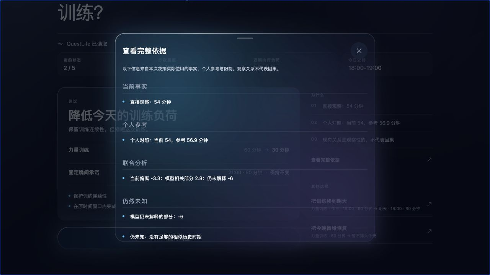
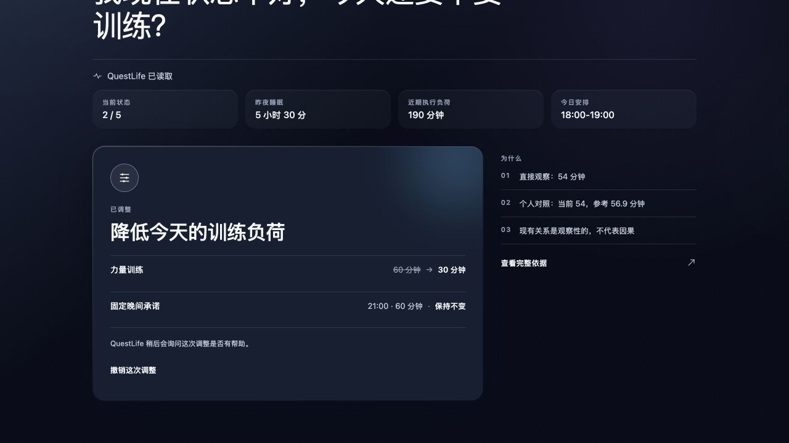
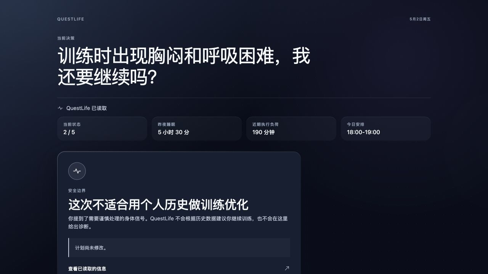

# Adaptive Decision Loop V2 - Single-Screen Decision Surface

## Scope

This branch productizes the existing Adaptive Decision Loop V1 without changing
its decision engine or persistence contracts. The user-facing wizard and QA
console are replaced by one resolved decision surface.

- Branch: `product/adaptive-decision-surface-v2`
- Validated code commit: `9a9bec1`
- Preview: `https://questlife-alpha-dwg6fdlg4-kyrie-z-s-projects.vercel.app`
- Preview access: Vercel-authenticated browser session required
- Production: unchanged

## Product Delta

Removed from the normal decision experience:

- manual context-assembly action
- step/progress navigation
- scenario tabs and reset controls
- telemetry, fixture, and internal-state copy
- before/after developer panels
- equal-weight proposal cards

The initial screen now presents the actual question, automatically assembled
relevant context, one dominant recommendation, its exact plan mutation, concise
evidence, up to two alternatives, and one Apply action.

## Interaction

- Mature context: one Apply tap from open to exact plan mutation.
- Evidence inspection: optional sheet; it is not required to apply.
- Alternative selection: updates recommendation, rationale, and plan patch in
  place.
- Missing context: at most two inline questions, then resolves on the same
  surface.
- Apply: reuses the V1 proposal selection and exact plan-patch application.
- Undo: reuses the V1 exact rollback and restores the pre-apply surface.
- Safety: renders an abstention state and exposes no ordinary Apply action.

## Preserved Backend

The V1 Decision Episode state machine, context assembly, missing-question
policy, evidence packet, proposal generation, plan-patch semantics, Apply,
Undo, follow-up, Decision Memory, safety gate, and deterministic fixtures remain
the functional authority. V2 adds presentation mapping and flow orchestration;
it does not add a second decision system.

## Validation

Local checks:

- `npm run test:adaptive-decision`: 10 suites passed, including all V1 suites
  and the new V2 presentation and flow suites.
- `npx tsc --noEmit`: passed.
- `npm run build`: passed; output directory `dist`.
- Local bundle: `index-cbf5ee839e2700f31fe8f498c63313bd.js`.
- Responsive browser checks: 375, 393, 430, and 1280 pixels; no horizontal
  overflow and no developer chrome.
- Theme/language checks: dark/light and Chinese/English rendered.

Authenticated Vercel Preview checks:

- Preview bundle: `index-c9df1e6d17c34a8d1e583999621787da.js`.
- Training initial recommendation, evidence sheet, Apply receipt, and exact Undo
  passed.
- Alternative proposal updates the exact plan patch in place.
- One missing answer resolves on the same screen.
- Sparse state remains actionable and explicitly limits personal-history claims.
- Safety abstention leaves the plan unchanged and exposes no Apply action.
- Cognitive and overloaded scenarios render their resolved recommendation
  directly.
- No-flag root still renders the existing QuestLife product surface.
- Browser console contained no V2 runtime errors.

Unverified:

- Physical iPhone Safari interaction was not run in this pass.
- Anonymous Preview access is blocked by Vercel Authentication; verification
  used the owner's authenticated Chrome session.
- The existing Expo notifications web-support warning remains outside this
  feature's scope.

## Screenshots

### A - Training initial decision

### B - Training full evidence

### C - Training applied receipt

### D - Cognitive initial decision

### E - Overloaded-day initial decision

### F - Safety abstention

